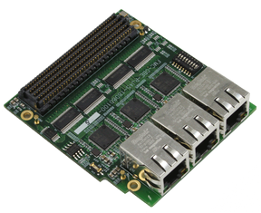

# FMC-GbE-RJ45TM Examples
These examples are prepared in the hope that it will be useful to understand Future Design Systems’ **FMC-GbE-RJ45**, but WITHOUT ANY WARRANTY. The design is not guaranteed to work on all systems. No technical support will be provided for problems that might arise

## License
**Copyright 2018-2019 Future Design Systems, Inc.** 
This is licensed with the 2-clause BSD license to make the program and library useful in open and closed source products independent of their licensing scheme. 
Each contributor holds copyright over their respective contributions.

# FMC-GbE-RJ45
FMC-GbE-RJ45 is an FMC board with three ports of Gigabit Ethernet.
FMC-GbE-RJ45 is compliant with the VITA 57.1 standard and can be mounted on FMC (LPC and HPC) and FMC+ (HPC+).
FMC-GbE-RJ45 can be used to setup HSR (High-availability Seamless Redundancy, IEC-62439-3) with any FPGA board with FMC connector.
More details can be found at <a href="http://www.future-ds.com/en/products.html#FMC_GBE_RJ45" target="_blank">here</a>.

---

# 1. <a href="file:./hsr.redbox/README.md" target="_blank">hsr.redbox</a>

# 2. <a href="file:./hsr.danh.arm/README.md" target="_blank">hsr.danh.arm</a>

# 3. <a href="file:./hsr.danh.petalinux/README.md" target="_blank">hsr.danh.petalinux</a>

# 4. <a href="file:./ptp.arm/README.md" target="_blank">ptp.arm</a>

---
## Contact
* <a href="http://www.future-ds.com" target="_blank">**Future Design Systems**</a>
* **[contact@future-ds.com](mailto:contact@future-ds.com)**
