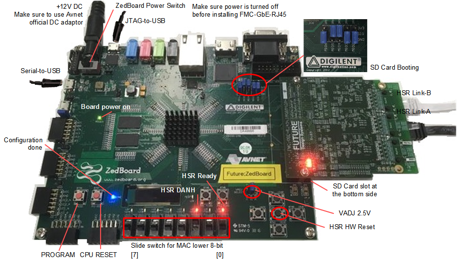
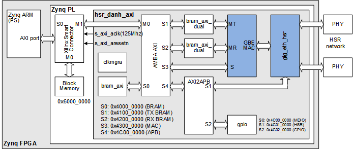

# DANH on ARM Bare Metal with <a href="http://www.future-ds.com/en/products.html#FMC_GBE_RJ45" target="_blank">FMC-GbE-RJ45</a>
This example uses two **DANH**s (*Double Attached Node implementing High-availability Seamless Redundancy*) as shown in the picture below,
where PS (Processing System) in the FPGA, i.e., ARM runs program without operating system.


## License
**Copyright 2018-2019 Future Design Systems, Inc.**<br>
This is licensed with the 2-clause BSD license to make the program and library useful in open and closed source products independent of their licensing scheme.<br>
Each contributor holds copyright over their respective contributions.

This example is prepared in the hope that it will be useful to understand Future Design Systems’ **FMC-GbE-RJ45**, but WITHOUT ANY WARRANTY. The design is not guaranteed to work on all systems. No technical support will be provided for problems that might arise

## Prerequisites
This example requires followings.
* Shell: Bash
* HDL simulator: Xilinx Vivado XSIM or Mentor Graphics ModelSim/QuestSim
* ARM SW development: Xilinx SDK
* FPGA development: Xilinx Vivado
* FPGA board: Xilinx Zynq FPGA mounted board with FMC (E.g., Avnet ZedBoard board)
* Multiport Gigabit Ethernet board: Future Design Systems' FMC-GbE-RJ45

# 0. Getting started
If you are ready then do as follows.

   1. Copy following file to SD Card
      * hsr.danh.arm/bootgen/BOOT.bin
   2. Insert the SD Card into the ZedBoard
   3. Connect USB-to-Serial to your computer through USB port
      * It is for text terminal emulator.
   4. Make sure all jumpers and switches are set correctly
      * For details see picture below
   5. Turn on the ZedBoard
   6. Invoke text-terminal emulator with following configurations
      * 115200 baud; 8-bit; no-parity; 1-stop
   8. Now user application starts
      * For details see <a href=#testing>this</a> section.



---
# 1. Check or prepare environment
This example is prepared on Ubuntu 16.04.<br>
<details>

### 1.1 FMC-GbE-RJ45
This example requires FMC-GbE-RJ45 board.

### 1.2 Xilinx
This example requires Xilinx development packages, which are Xilinx Vivado and SDK.

If Xilinx Vivado and SDK pkg are installed on */opt/Xilinx/Vivado/2018.3* and
*/opt/Xilinx/SDK/2018.3*, respectively,
then source following scripts.

    $ source /opt/Xilinx/Vivado/2018.3/settings64.sh
    $ source /opt/Xilinx/SDK/2018.3/settings64.sh

It can be checked as follows.

    $ which vivado
      /opt/Xilinx/Vivado/2018.3/bin/vivado
    $ which xsdk
      /opt/Xilinx/SDK/2018.3/bin/xsdk

### 1.3 HDL simulator
This example uses one of following HDL simulators to run simulation.
* Xilinx Vivado Simulator (xsim)
* Mentor Graphics ModelSim or QuestaSim
</details>

# 2. Internal design
Following picture shows a detailed structure of the design.



The blocks blue-colored are encrypted and
contact [Future Design Systems](mailto:contact@future-ds.com) if you need further information.

# 3. Design flow
This example need to follow two major steps.

   1. HW preparation<br>
      It prepares HDF (Hardware Definition File) and Bitstream file;
      the former is for SW development and the latter is for FPGA configuration.
   2. SW preparation<br>
      It prepares ELF (Executable and Linking Format) SW for PS (Processing System) of FPGA.

<details>

### 3.1 HW preparation
This step prepares user HW blocks and integrates all for PL.


### 3.2 SW preparation
This step prepares user SW program for ARM.

### 3.3 All together


</details>

# 4. HW preparation
This step prepares necessary HW blocks and FPGA bitstream.

<details>

This step requires Xilinx development packages, which is Xilinx Vivado.

If Xilinx Vivado pkg is installed on */opt/Xilinx/Vivado/2018.3*,
then source following scripts.

    $ source /opt/Xilinx/Vivado/2018.3/settings64.sh

It can be checked as follows.

    $ which vivado
      /opt/Xilinx/Vivado/2018.3/bin/vivado


### 4.1 Prepare IP
This example uses following module.

  * bram_axi
  * bram_axi_dual
  * gig_eth_mac
  * gig_eth_hsr
  * amba_axi
  * axi_to_apb

Those HW blocks are given in the directory specified by *$FIP_HOME* environment variable.

<details>

This step requires Xilinx package and you should reflect the correct version if the version is not *2018.3*.

This step uses Avnet ZedBoard and you should reflect the correct one if the board is not the same.
The ZedBoard has Zynq7000 series FPGA and 'z7' indicates FPGA type Zynq7000.

#### 4.1.1 bram_axi
It is a memory with single-port AMBA AXI utilizing Xilinx BRAM.
This example uses 16Kbyte size of memory.

  1. go to '$FIP_HOME/mem_axi/bram_simple_dual_port' directory<br />
     ```
     $ cd $FIP_HOME/mem_axi/bram_simple_dual_port
     ```
  2. further down to sub-directory implying FPGA type<br />
     ```
     $ cd z7
     ```
  3. further down to sub-directory for version of Xilinx package<br />
     ```
     $ cd vivado.2018.3
     ```
  4. run 'make'<br />
     ```
     $ make
     ```
The 'make' takes time and prepares all necessary Xilinx dual-port BRAM.
You can change memory size as follows.

#### 4.1.2 bram_axi_dual
It is a memory with dual-port AMBA AXI utilizing Xilinx BRAM.
This example uses 16Kbyte size of memory.

  1. go to '$FIP_HOME/mem_axi_dual/bram_true_dual_port' directory<br />
     ```
     $ cd $FIP_HOME/mem_axi/bram_true_dual_port
     ```
  2. further down to sub-directory implying FPGA type<br />
     ```
     $ cd z7
     ```
  3. further down to sub-directory for version of Xilinx package<br />
     ```
     $ cd vivado.2018.3
     ```
  4. run 'make'<br />
     ```
     $ make
     ```
The 'make' takes time and prepares all necessary Xilinx dual-port BRAM.
You can change memory size as follows.

#### 4.1.3 gig_eth_mac
It is Gigabit Ethernet MAC (Media Access Controller).

  1. go to following directory and run make<br />
     ```
     $ cd $FIP_HOME/gig_eth_mac/fifo_async/z7/vivado.2018.3
     $ make
     ```

To see how it works using HDL simulator.

  1. go to following directory and run make<br>
     ```
     $ cd $FIP_HOME/gig_eth_mac/sim/xsim
     $ make
     ```
  2. open 'wave.vcd' using VCD viewer, e.g., GTKwave.
     ```
     $ gtkwave wave.vcd
     ```

#### 4.1.4 gig_eth_hsr
It is Gigabit Ethernet HSR (High-availability Seamless Redundancy Controller).

  1. go to following directory and run make<br />
     ```
     $ cd $FIP_HOME/gig_eth_hsr/fifo_async/z7/vivado.2018.3
     $ make
     ```
  2. go to following directory and run make<br />
     ```
     $ cd $FIP_HOME/gig_eth_hsr/fifo_sync/z7/vivado.2018.3
     $ make
     ```

To see how it works using HDL simulator.

  1. go to following directory and run make<br>
     ```
     $ cd $FIP_HOME/gig_eth_hsr/sim/xsim
     $ make
     ```
  2. open 'wave.vcd' using VCD viewer, e.g., GTKwave.
     ```
     $ gtkwave wave.vcd
     ```

#### 4.1.5 amba_axi and axi_to_apb
These blocks can be prepared by <a href="https://github.com/adki/gen_amba" target="_blank">GEN AMBA</a>.

</details>

### 4.2 HW simulation
This step run simulation in order to verify functionality,
where a few number of HSR nodes are connected to build HSR ring
and each HSR node consists of tester and the design for PL.


<details>

#### 4.2.1 Xilinx Vivado Simulator

  1. go to 'hw/sim/xsim'
  2. 'BOARD_ZED' macro should be defined in 'sim_define.v' file.
  3. run 'make'<br />
     ```
     $ make
     ```
     For more details, have a look at 'Makefile'.
  4. check simulation result by viewing 'wave.vcd'<br>
     This step requires VCD viewer, for example GTKwave.
     ```
     $ gtkwave wave.vcd
     ```

Following simulation wave demonstrates a scenario that NODE 0 sends a packet to NODE 1.

  1. NODE 0 duplicates the packet and sends NODE 1 and NODE 2
  2. NODE 1 receives a packet from NODE 0
     1. forwards it to the processor since it matches its MAC
     2. does not forward to NODE 2
  3. NODE 2 receives a packet form NODE 0
     1. forwards it to the NODE 1 since it does not matches its MAC
     2. does not forward it to the processor
  4. NODE 1 receives a packet from NODE 2
     1. removes it since it has been received already (It is called Quick Remove.)


You can add or modify testing scenario by updating 'tester.v' in 'hw/beh/verilog' directory.

#### 4.2.2 Mentor Graphics ModelSim or QuestaSim

  1. go to 'hw/sim/modelsim.vivado
  2. 'BOARD_ZED' macro should be defined in 'sim_define.v' file.
  3. run 'make'<br />
     ```
     $ make
     ```
     For more details, have a look at 'Makefile'.
  4. check simulation result by viewing 'wave.vcd'<br>
     This step requires VCD viewer, for example GTKwave.
     ```
     $ gtkwave wave.vcd
     ```
</details>

### 4.3 FPGA Implementation

<details>

  1. Prepare EDIF for the design
      ```
      $ cd hw/syn/vivavo.zedboard.lpc
      $ make
      ```
  2. Prepare 'hsr_danh_axi.xpr' and 'component.xml'
      ```
      $ cd hw/gen_ip
      $ make
      ```
  3. Go to run
      ```
      $ cd hw/impl/zedboard.lpc
      $ make
      ```
  4. check followings in 'hw/impl/zedboard.lpc' directory
     * "zed_bd_wrapper.bit"
     * "zed_bd_wrapper_sysdef.hdf" (It can be check by "$ unzip -l zed_bd_wrapper.hdf".) (It also contains 'zed_bd_wrapper.bit'.)
</details>
</details>

# 5. SW preparation
This step compiles user application.

<details>

This step requires Xilinx software development packages, which is Xilinx SDK.

If Xilinx SDK is installed on */opt/Xilinx/SDK/2018.3*,
then source following script.

    $ source /opt/Xilinx/SDK/2018.3/settings64.sh

It can be checked as follows.

    $ which xsdk
      /opt/Xilinx/SDK/2018.3/bin/xsdk

This example uses a program that can send and receive packets.

### 5.1 Compilation

   ```
   $ cd sw.arm/eth_send_receive
   $ make
   ```

### 5.2 Program: eth_send_receive
This program provides a simple user interface through command line with following commands.

   * system initialization
      * mac_init
      * hsr_init
   * system checking
      * mac_csr
      * hsr_csr
   * MAC address
      * mac_addr
   * packet handling
      * pkt_snd
      * pkt_rcv

</details>

# 6. <a id="testing">Testing</a>
This step programs FPGA and runs program.

<details>

This step requires a text terminal emulator (e.g., Hyperterminal, Teraterm, minicom, GTKterm)
to interacts with the program and it uses USB-to-Serial port.
The USB-to-Serial port uses 115200-baud, 8-bit, no-parity, 1-stop bit.
When HW bitstream and SW image are downloaded as described in this following section,
a monitor program runs.

First of all, connect USB-to-Serial and USB-to-JTAG, and then
download HW bitstream and SW binary to the board through USB-to-JTAG
as described in section 5.2 Download through JTAG port.

### 6.1 FPGA configuration
You can use one of two ways to configure FPGA.

#### 6.1.1 SD Card preparation (optional)
HW bitstream and SW binary can be downloaded to the board through JTAG port, and
this method needs to do again each time turning on the board.
HW bitstream and SW binary can be stored in SD Card, and
this method makes the board start automatically when turned on.

  1. Prepare FSBL (First Stage Boot Loader)
     $ cd sw.arm/fsbl
     $ make
  2. Prepare SD Card image
     $ cd bootgen
     $ make
  3. Copy 'BOOT.bin' to the SD Card (It should be FAT32 file system.)
     * Insert this SD Card into the ZedBoard
     * Make sure setting of jumper: JP-7/8/9/10/11 = G/G/V/V/G

#### 6.1.2 Download through JTAG port
HW bitstream and SW binary can be downloaded to the board through JTAG port or SD card.

   ```
   $ cd sw.arm/eth_send_receive
   $ make download
   ```

### 6.2 Single packet
Following sequence demonstrates how 'Terminal A' sends a packet to 'Terminal B',
in which 'Terminal A' and 'Terminal B' have MAC address 0x021234567801 and 0x021234567802, respectively.

|Terminal A (HSR Node 0)|Terminal B (HSR Node 1)| *Remarks* |
| --- | --- | --- |
| monitor> *mac_init*    | monitor> *mac_init*    | initialize |
| monitor> *mac_addr -r*<br>MAC 0x021234567801<br>HSR 0x021234567801 | monitor> *mac_addr -r*<br> MAC 0x021234567802<br> HSR 0x021234567802| check MAC and HSR addresses.<br>These two should be the same.<br>Actual values depends on board ID.|
| monitor> *pkt_snd -b 0x021234567802*| &nbsp; | Send a packet to the other |
| &nbsp;               | monitor> *pkt_rcv -v 3*<br>ETH mac dst: | Receive a packet |

### 6.3 Multiple packets

| Terminal A | Terminal B | Remarks |
| --- | --- | --- |
| monitor> *mac_init*   | monitor> *mac_init*   | initialize |
| monitor> *mac_addr -r*<br>MAC 0x021234567801<br>HSR 0x021234567801 | monitor> *mac_addr -r*<br> MAC 0x021234567802<br> HSR 0x021234567802| check MAC and HSR addresses.<br>These two should be the same.<br>Actual values depends on board ID.|
| &nbsp;               | monitor> *pkt_rcv -v 3 -r*| Receive packets |
| monitor> *pkt_snd -b 0x021234567802 -r*| &nbsp; | Send packets |
| &nbsp; | &nbsp; | Terminal B prints<br>packet information continuously.|

</details>

---
## Contact
* <a href="http://www.future-ds.com" target="_blank">**Future Design Systems**</a>
* **[contact@future-ds.com](mailto:contact@future-ds.com)**
