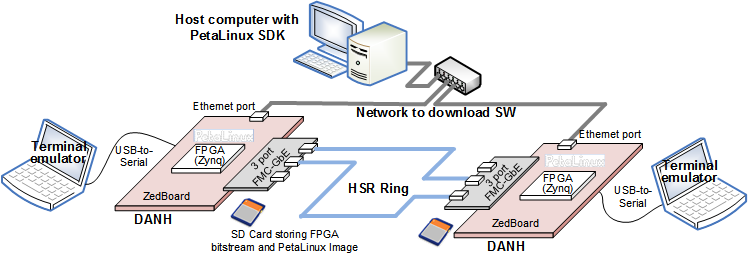
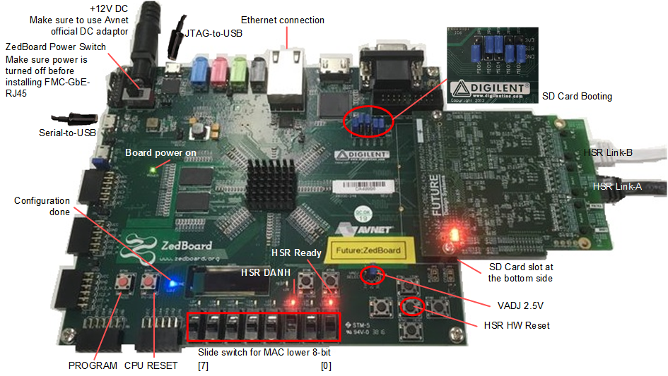
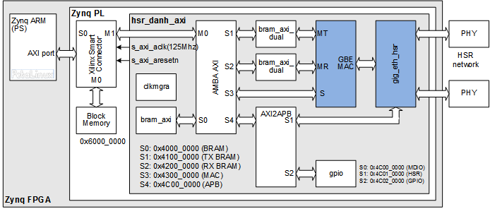
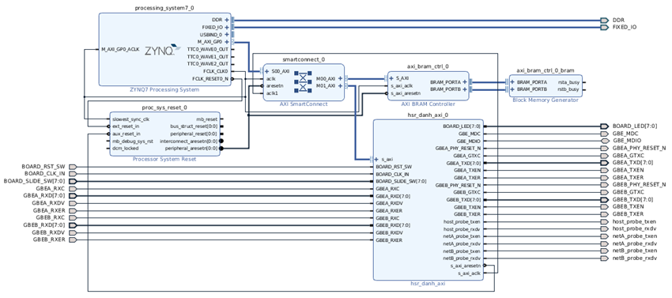

# DANH on ARM PetaLinux with <a href="http://www.future-ds.com/en/products.html#FMC_GBE_RJ45" target="_blank">FMC-GbE-RJ45</a>
This example uses two **DANH**s (*Double Attached Node implementing High-availability Seamless Redundancy*) as shown in the picture below,
where PS (Processing System) in the FPGA, i.e., ARM runs program with PetaLinux.



## License
**Copyright 2018-2019 Future Design Systems, Inc.**<br>
This is licensed with the 2-clause BSD license to make the program and library useful in open and closed source products independent of their licensing scheme.<br>
Each contributor holds copyright over their respective contributions.

This example is prepared in the hope that it will be useful to understand Future Design Systems’ **FMC-GbE-RJ45**, but WITHOUT ANY WARRANTY. The design is not guaranteed to work on all systems. No technical support will be provided for problems that might arise

## Prerequisites
This example requires followings.
* Shell: Bash
* HDL simulator: Xilinx Vivado XSIM or Mentor Graphics ModelSim/QuestSim
* FPGA development: Xilinx Vivado
* ARM SDK: Xilinx SDK
* PetaLinux development: Xilinx PetaLinux
* FPGA board: Xilinx Zynq FPGA mounted board with FMC (E.g., Avnet ZedBoard board)
* Multiport Gigabit Ethernet board: Future Design Systems' FMC-GbE-RJ45

# 0. Getting started
If you are ready then do as follows.

   1. Copy following two files to SD Card
      * hsr.danh.petalinux/petalinux/zed-plnx/images/linux/BOOT.bin
      * hsr.danh.petalinux/petalinux/zed-plnx/images/linux/image.ub
   2. Insert the SD Card into the ZedBoard
   3. Connect USB-to-Serial to the host computer through USB port
      * It is for text terminal emulator.
   4. Connect Ethernet (PS not HSR) to the network that reaches to the host computer
   5. Make sure all jumpers and switches are set correctly
      * For details see picture below
   6. Turn on the ZedBoard
   7. Invoke text-terminal emulator with following configurations
      * 115200 baud; 8-bit; no-parity; 1-stop
   8. PetaLinux should bring up
      * Login ID: root
      * Login PW: root
   9. Now user application can be downloaded through Ethernet from the host computer
      * For details see <a href=#testing>this</a> section.



---

# 1. <a name="environment"></a>Check or prepare environment
This example is prepared on Ubuntu 16.04.<br>
<details>

### 1.1 FMC-GbE-RJ45
This example requires FMC-GbE-RJ45 board.

### 1.2 Xilinx
This example requires Xilinx development packages, which are Xilinx Vivado and SDK.

If Xilinx Vivado and SDK pkg are installed on */opt/Xilinx/Vivado/2018.3* and
*/opt/Xilinx/SDK/2018.3*, respectively,
then source following scripts.

    $ source /opt/Xilinx/Vivado/2018.3/settings64.sh
    $ source /opt/Xilinx/SDK/2018.3/settings64.sh

It can be checked as follows.

    $ which vivado
      /opt/Xilinx/Vivado/2018.3/bin/vivado
    $ which xsdk
      /opt/Xilinx/SDK/2018.3/bin/xsdk

### 1.3 HDL simulator
This example uses one of following HDL simulators to run simulation.
* Xilinx Vivado Simulator (xsim)
* Mentor Graphics ModelSim or QuestaSim

### 1.4 PetaLinux SDK
*PetaLinux* is an embedded Linux development solution for Xilinx Zynq chips.
PetaLinux SDK is available from <a href="https://www.xilinx.com/support/download/index.html/content/xilinx/en/downloadNav/embedded-design-tools.html" target="_blank">here</a>.

* PetaLinux 2018.3 Installer: PetaLinux SDK
* ZED BSP: avenet-digilent-zedboard-v2018.3-final.bsp

<details>

#### 1.4.1 Install PetaLinux SDK

1. Download installer "PetaLinux 2018.3 Installer" from https://www.xilinx.com/support/download/index.html/content/xilinx/en/downloadNav/embedded-design-tools.html
     ```
     ./petalinux-v2018.3-final-installer.run
     ```
2. Move the installer file to a user director, say ${HOME}/tmp and run it with installation directory as argument. (You may need to change the file permission to executable.)
     ```
     $ ./petalinux-v2018.3-final-installer.run ${HOME}/work/projects/PetaLinux
     ```
     * While installing PetaLinux SDK, error can raise due to pre-requisites program. Install the pre-requisites and then re-run the installer.

3. Make 'bsp' directory in the installation directory, i.e., ${HOME}/work/projects/PetaLinux/bsp, and mv the BSP file into that.
     ```
    $ cp ~/Download/avnet-digilent-zedboard-v2018.3-final.bsp ${HOME}/work/projects/PetaLinux/bsp
     ```
</details>

</details>

# 2. Internal design
Following picture shows a detailed structure of the design.



The blocks blue-colored are encrypted and
contact [Future Design Systems](mailto:contact@future-ds.com) if you need further information.

# 3. Design flow
This example need to follow three major steps.

   1. HW preparation<br>
      It prepares HDF (Hardware Definition File) and Bitstream file;
      the former is for SW development and the latter is for FPGA configuration.
   2. PetaLinux preparation<br>
   3. SW preparation<br>
      It prepares ELF (Executable and Linking Format) SW for PS (Processing System) of FPGA.

# 4. HW preparation
This example uses the same HW of <a href="../hsr.danh.arm/README.md" target="_blank">DANH on ARM Bare Metal with FMC-GbE-RJ45</a>.



# 5. PetaLinux preparation

<details>

### 5.1 Building PetaLinux
This step building PetaLinux.

   ```
   $ cd hsr.danh.petalinux/petalinx
   $ source ${HOME}/work/projects/PetaLinux/settings.sh
   $ source /opt/Xilinx/SDK/2018.3/settings64.sh
   $ make
   ```
While running make, there are two steps of '*petalinux-config*' you should set configure as follows.

[The first petalinux-config for HDF]<br>
* Yocto Settings->Enable Network state feeds: disable<br> 
* Image Packaging Configuration->Copy final images to ftpboot: disable<br>

[The second petalinux-config for ROOTFS]<br>
* Filesystem Packages->misc->gcc-runtime->{libstdc++, libstdc++-dev}: enable<br>
* Filesystem Packages->console->network->dropbear->dropbear: enable<br>
* Filesystem Packages->console->network->openssh->openssh-sftp-server: enable<br>

'*petalinux-build*' is following this ROOTFS configuration, and following two files should be ready on completion.

* zed-plnx/images/linux/BOOT.BIN: Boot loader and FPGA bit-stream
* zed-plnx/images/linux/image.ub: Linux kernel image

### 5.2 Booting from SD Card
ZedBoard can be configured using SD Card. The boot configuration DIP switches should be set properly; consult manual for details.
The USB-to-Serial port uses 115200-baud, 8-bit, no-parity, 1-stop bit.

1. Prepare ZedBoard with FMC-GbE-RJ45
  * Port 1 for HSR Link-A
  * Port 2 for HSR Link-B
  * For this DANH, Upstream link is not used (i.e., port 0)
2. Connect USB-to-Serial and invoke terminal emulator
3. Connect Ethernet
4. Go to 'petalinux' directory and copy following two files to SD Card.
  * zed-plnx/images/linux/BOOT.BIN: Boot loader and FPGA bit-stream
  * zed-plnx/images/linux/image.ub: Linux kernel image
5. Insert SD Card to the ZedBoard
  * Make sure ZedBoard is turned off
  * Make sure Booting mode selection switches are properly set as shown in Figure 5.
6. Turn on ZedBoard
  * Configuration DONE LED should be on.
  * Two LEDs should be on as shown in the picture; one for HSR ready and the other for DANH indicator.


Push button switches:
 * HSR HW Reset: It raises reset for PL and does not affect PS.
 * CPU Reset: It raises reset for PS and makes restart PetaLinux.
 * PROGRAM: It makes FPGA program.

### 5.2 Changing MAC address
This example requires each board has unique MAC address.

* PetaLinux uses Ethernet to communicate host computer, which is used to compile and download application programs.
  * Each PetaLinux should be set a unique MAC HW address when there are more than one PetaLinux since PetaLinux uses static MAC HW address.
* MAC for HSR uses a unique MAC HW address
  * It is automatically determined by reading 8-bit Board ID switch.

In order to set user specific MAC HW address, do as follows.

* Boot PetaLinux
  * (This step may not require.) For some case following steps are also required in the PentaLinux
     ```
     PetaLinux$ rm /etc/udev/rules.d/70-persistent-net.rules
     PetaLinux$ sync
     PetaLinux$ reboot
     ```
* While booting, stop before starting Linux. Now it is uBoot command line.
  * You need to hit any key while 'Hit any key to stop autoboot: ...'.

* Set MAC HW address something like
  * (Note that this step update flash memory. It means MAC HW address updated permanently)
  * (Make sure that the second bit of the first octet should be 1, which indicates locally managed address)
    ```
    Zynq> setenv ethaddr 02:0A:35:00:1E:50 
    Zynq> saveenv
          Saving Environment to SPI Flash...
          SF: Detected s25fl256s_64k with page size 256 Bytes, erase size 64 KiB, total 32 MiB
          Erasing SPI flash...Writing to SPI flash...done
    Zynq> reset (NOT 'boot')
    ```
* Now PetaLinux brings up
* Petalinux login will be "root" and its passwd will be "root".
  * Check MAC HW address as follows.
    ```
    PetaLinux$ ifconfig
    ```

</details>


# 7. Testing<a id="testing"></a>
This step programs FPGA and runs program.

<details>

This step requires a text terminal emulator (e.g., Hyperterminal, Teraterm, minicom, GTKterm)
to interacts with the program and it uses USB-to-Serial port.
The USB-to-Serial port uses 115200-baud, 8-bit, no-parity, 1-stop bit.
When HW bitstream and SW image are downloaded as described in Section '5.2 Download through JTAG port',
a monitor program runs.

First of all, connect USB-to-Serial and USB-to-JTAG, and then
download HW bitstream and SW binary to the board through USB-to-JTAG
as described in section 5.2 Download through JTAG port.

### 7.1 Booting PetaLinux from SD Card
<details>

HW bitstream and SW binary can be downloaded to the board through JTAG port, and
this method needs to do again each time turning on the board.
HW bitstream and SW binary can be stored in SD Card, and
this method makes the board start automatically when turned on.

  1. Copy following files to the SD Card (It should be FAT32 file system.)
     * petalinux/zed-plnx/images/linux/BOOT.bin: Bootload and FPGA bitstream
     * petalinux/zed-plnx/images/linux/image.ub: PetaLinux image

  2. Turn on ZedBoard
     * Insert this SD Card into the ZedBoard
     * Make sure setting of jumper: JP-7/8/9/10/11 = G/G/V/V/G
</details>

### 7.2 SW preparation
This step compiles user application at the host computer using PetaLinux SDK.

<details>

This step requires Xilinx PetaLinux development package.

If Xilinx PetaLinux SDK is installed on *${HONE}/work/projects/PetaLinux*,
then source following script.

    $ source ${HOME}/work/projects/PetaLinux/settings.sh

It can be checked as follows.

    $ which arm-linux-gnueabihf-gcc

This example uses a program that can send and receive packets.

#### 7.2.1 Compilation

   ```
   $ cd sw.arm.petalinux/eth_send_receive
   $ make
   ```

#### 7.2.2 Program: eth_send_receive
This program provides a simple user interface through command line with following commands.

   * system initialization
      * mac_init
      * hsr_init
   * system checking
      * mac_csr
      * hsr_csr
   * MAC address
      * mac_addr
   * packet handling
      * pkt_snd
      * pkt_rcv

</details>

### 7.3 Download user application
Now download ARM executable to the ZedBoard using scp (secure copy command) through Ethernet.
<details>

The program should be download to each ZedBoard,
in which, the correct IP address (e.g., '192.168.1.235') of each ZedBoard can be checked using 'ifconfig' command.

```
$ scp eth_send_receive root@192.168.1.235:/home/root
```
Your will be asked to confirm the secure connection and then password for 'root' at the PetaLinux.
'*eth_send_receive*' program should be available at the '*/home/root*' directory of the PetaLinux.
```
PetaLinux$ pwd
/home/root
PetaLinux$ ls
eth_send_receive
```

If there is any error regarding SSH, do again after removing SSH key something like as follows.
```
$ ssh-keygen -f "${HONE}/.ssh/known_hosts" -R 192.168.1.235
```
</details>

### 7.4 Single packet
Following sequence demonstrates how 'Terminal A' sends a packet to 'Terminal B',
in which 'Terminal A' and 'Terminal B' have MAC address 0x021234567801 and 0x021234567802, respectively.

|Terminal A (HSR Node 0)|Terminal B (HSR Node 1)| *Remarks* |
| --- | --- | --- |
| monitor> *mac_init*    | monitor> *mac_init*    | initialize |
| monitor> *mac_addr -r*<br>MAC 0x021234567801<br>HSR 0x021234567801 | monitor> *mac_addr -r*<br> MAC 0x021234567802<br> HSR 0x021234567802| check MAC and HSR addresses.<br>These two should be the same.<br>Actual values depends on board ID.|
| monitor> *pkt_snd -b 0x021234567802*| &nbsp; | Send a packet to the other |
| &nbsp;               | monitor> *pkt_rcv -v 3*<br>ETH mac dst: | Receive a packet |

### 7.5 Multiple packets

| Terminal A | Terminal B | Remarks |
| --- | --- | --- |
| monitor> *mac_init*   | monitor> *mac_init*   | initialize |
| monitor> *mac_addr -r*<br>MAC 0x021234567801<br>HSR 0x021234567801 | monitor> *mac_addr -r*<br> MAC 0x021234567802<br> HSR 0x021234567802| check MAC and HSR addresses.<br>These two should be the same.<br>Actual values depends on board ID.|
| &nbsp;               | monitor> *pkt_rcv -v 3 -r*| Receive packets |
| monitor> *pkt_snd -b 0x021234567802 -r*| &nbsp; | Send packets |
| &nbsp; | &nbsp; | Terminal B prints<br>packet information continuously.|
</details>

</details>

---
## Contact
* <a href="http://www.future-ds.com" target="_blank">**Future Design Systems**</a>
* **[contact@future-ds.com](mailto:contact@future-ds.com)**
