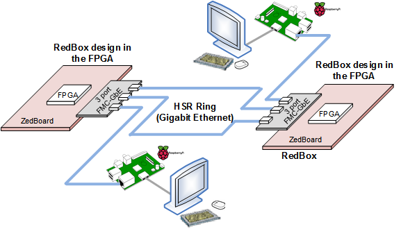
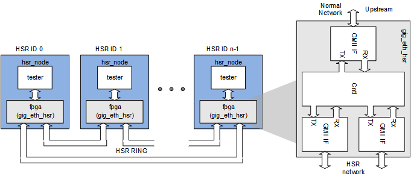

# RedBox with <a href="http://www.future-ds.com/en/products.html#FMC_GBE_RJ45" target="_blank">FMC-GbE-RJ45</a>
This example uses two **RedBox**s (*Redundancy Box*) as shown in the picture below, in which each RedBox duplicates packets receved from its upstream port.



## License
**Copyright 2018-2019 Future Design Systems, Inc.**<br>
This is licensed with the 2-clause BSD license to make the program and library useful in open and closed source products independent of their licensing scheme.<br>
Each contributor holds copyright over their respective contributions.

This example is prepared in the hope that it will be useful to understand Future Design Systems’ **FMC-GbE-RJ45**, but WITHOUT ANY WARRANTY. The design is not guaranteed to work on all systems. No technical support will be provided for problems that might arise

## Prerequisites
This example requires followings.
* Shell: Bash
* HDL simulator: Xilinx Vivado XSIM or Mentor Graphics ModelSim/QuestSim
* FPGA development: Xilinx Vivado
* FPGA board: Xilinx Zynq FPGA mounted board with FMC (E.g., Avnet ZedBoard board)
* Multiport Gigabit Ethernet board: Future Design Systems' FMC-GbE-RJ45

# 0. Getting started
If you are ready then do as follows.

   1. Copy following file to SD Card
      * hsr.redbox/pnr/vivado.zedboard.lpc/bootgen/BOOT.bin
   2. Insert the SD Card into the ZedBoard
   4. Make sure all jumpers and switches are set correctly
      * For details see picture below
   5. Turn on the ZedBoard
   8. Now user HSR RedBox starts


---
# 1. Check or prepare environment
This example is prepared on Ubuntu 16.04.<br>
<details>

### 1.1 FMC-GbE-RJ45
This example requires FMC-GbE-RJ45 board.

### 1.2 Xilinx
This example requires Xilinx development packages, which is Xilinx Vivado.

If Xilinx Vivado pkg is installed on */opt/Xilinx/Vivado/2018.3*,
then source following script.

    $ source /opt/Xilinx/Vivado/2018.3/settings64.sh

It can be checked as follows.

    $ which vivado
      /opt/Xilinx/Vivado/2018.3/bin/vivado

### 1.3 HDL simulator
This example uses one of following HDL simulators to run simulation.
* Xilinx Vivado Simulator (xsim)
* Mentor Graphics ModelSim or QuestaSim

</details>

# 2. Internal design
Following picture shows a detailed structure of the design.


The block is encrypted and
contact [Future Design Systems](mailto:contact@future-ds.com) if you need further information.

# 3. HW preparation

<details>

### 3.1 Prepare IP
This example uses following module.

  * gig_eth_hsr

<details>

Those HW blocks are given in the directory specified by *$FIP_HOME* environment variable.

This step requires Xilinx package and you should reflect the correct version if the version is not *2018.3*.

This step uses Avnet ZedBoard and you should reflect the correct one if the board is not the same.
The ZedBoard has Zynq7000 series FPGA and 'z7' indicates FPGA type Zynq7000.

#### 3.1.4 gig_eth_hsr
It is Gigabit Ethernet HSR (High-availability Seamless Redundancy Controller).

  1. go to following directory and run make<br />
     ```
     $ cd $FIP_HOME/gig_eth_hsr/fifo_async/z7/vivado.2018.3
     $ make
     ```
  2. go to following directory and run make<br />
     ```
     $ cd $FIP_HOME/gig_eth_hsr/fifo_sync/z7/vivado.2018.3
     $ make
     ```

To see how it works using HDL simulator.

  1. go to following directory and run make<br>
     ```
     $ cd $FIP_HOME/gig_eth_hsr/sim/xsim
     $ make
     ```
  2. open 'wave.vcd' using VCD viewer, e.g., GTKwave.
     ```
     $ gtkwave wave.vcd
     ```

</details>

### 3.2 HW simulation
This step run simulation in order to verify functionality,
where a few number of HSR nodes are connected to build HSR ring
and each HSR node consists of tester and the design for PL.



<details>

#### 3.2.1 Xilinx Vivado Simulator

  1. go to 'hw/sim/xsim'
  2. 'BOARD_ZED' macro should be defined in 'sim_define.v' file.
  3. run 'make'<br />
     ```
     $ make
     ```
     For more details, have a look at 'Makefile'.
  4. check simulation result by viewing 'wave.vcd'<br>
     This step requires VCD viewer, for example GTKwave.
     ```
     $ gtkwave wave.vcd
     ```

Following simulation wave demonstrates a scenario
that NODE 0 receives a packet from its upstream port.

  1. NODE 0 duplicates the packet and sends NODE 1 and NODE 2
  2. NODE 1 receives a packet from NODE 0
     1. forwards it to the NODE 2
  3. NODE 2 receives a packet form NODE 0
     1. forwards it to the NODE 1
  4. NODE 1 receives a packet from NODE 2
     1. removes it since it has been received already (It is called Quick Remove.)
  5. NODE 2 receives a packet from NODE 1
     1. removes it since it has been received already (It is called Quick Remove.)


Following simulation wave demonstrates a scenario
that NODE 0 receives a broadcasting packet from its upstream port.

  1. NODE 0 duplicates the packet and sends NODE 1 and NODE 2
  2. NODE 1 receives a packet from NODE 0
     1. forwards it to the NODE 2
     2. forwards it to the upstream port, since it is broadcasting
  3. NODE 2 receives a packet form NODE 0
     1. forwards it to the NODE 1
     2. forwards it to the upstream port, since it is broadcasting
  4. NODE 1 receives a packet from NODE 2
     1. removes it since it has been received already (It is called Quick Remove.)
  5. NODE 2 receives a packet from NODE 1
     1. removes it since it has been received already (It is called Quick Remove.)


You can add or modify testing scenario by updating 'tester.v' in 'hw/beh/verilog' directory.

#### 3.2.2 Mentor Graphics ModelSim or QuestaSim

  1. go to 'hw/sim/modelsim.vivado
  2. 'BOARD_ZED' macro should be defined in 'sim_define.v' file.
  3. run 'make'<br />
     ```
     $ make
     ```
     For more details, have a look at 'Makefile'.
  4. check simulation result by viewing 'wave.vcd'<br>
     This step requires VCD viewer, for example GTKwave.
     ```
     $ gtkwave wave.vcd
     ```
</details>

### 3.3 FPGA Implementation

<details>

  1. Prepare EDIF for the design
      ```
      $ cd hw/pnr/vivavo.zedboard.lpc
      $ make
      ```

</details>

</details>

# 4. FPGA programming
FPGA bitstream can be downloaded through USB-JTAG or program using SD Card.

<details>

### 4.2 Download through JTAG port
HW bitstream be downloaded to the board through JTAG port, and
this method needs to do again each time turning on the board.
Connect JTAG port.

   ```
   $ cd hw/pnr/vivado.zedboard.lpc/download
   $ make
   ```

### 4.2 SD Card preparation (optional)
HW bitstream can be stored in SD Card, and
this method makes the board start automatically when turned on.

  1. Prepare SD Card image
     $ cd hw/pnr/vivado.zedboard.lpc/bootgen
     $ make
  2. Copy 'BOOT.bin' to the SD Card (It should be FAT32 file system.)
     * Insert this SD Card into the ZedBoard
     * Make sure setting of jumper: JP-7/8/9/10/11 = G/G/V/V/G
</details>

# 5. Testing

### 5.1 Ping
This example tests HSR using **PING** application.

| Terminal A (Raspberry Pi 3 Model B+) | Terminal B | *Remarks* |
| --- | --- | --- |
| Open a terminal | Open a terminal | Prepare two terminals |
| $ *ifconfig*<br>eth0: ... inet 192.168.1.152 | $ *ifconfig*<br>eth0: ... inet 192.168.1.153 | Check IP address<br>$ *hostname -I* |
| $ *ping 192.168.1.153* | $ *ping 192.168.1.152* | Each runs ping command. |
| 64 bytes from 192.168.1.152: icmp_seq=1 ttl=64 time=0.594 ms<br>... | 64 bytes from 192.168.1.152: icmp_seq=1 ttl=64 time=0.594 ms<br>... | &nbsp; |

### 5.2 Webpage
This example accesses a web-page over the HSR network.

#### 5.2.1 Install webserver on Raspberry Pi
Simply install Apache.  <a href="https://www.raspberrypi.org/documentation/remote-access/web-server/apache.md" target="_blank">Refer to this page</a>.
```
$ sudo apt-get update
$ sudo apt-get install apache -y
```

New web-page can be installed by replacing following file.
```
/var/www/html/index.html
```

#### 5.2.2 Open the webpage
Open a web-page on a web browser.
```
http://192.168.1.152
```

#### 5.2.3 Web camera
Connect USB camera and check its status using following command.
```
$ lsusb
```

Edit *'/etc/motion/motion.conf'*.
```
Make sure 'daemon' is ON.
Set 'framerate' anywhere in between 1000 to 1500.
Keep 'Stream_port' to 8081.
'Stream_quality' should be 100.
Change 'Stream_localhost' to OFF.
Change 'webcontrol_localhost' to OFF.
Set 'quality' to 100.
Set 'width' & 'height' to 640 & 480.
Set 'post_capture' to 5.
Press ctrl + x to exit. Type y to save and enter to conform.
```

```
$ sudo service motion restart
$ sudo motion
```

```
192.168.1.152:8081
```

---
## Contact
* <a href="http://www.future-ds.com" target="_blank">**Future Design Systems**</a>
* **[contact@future-ds.com](mailto:contact@future-ds.com)**
